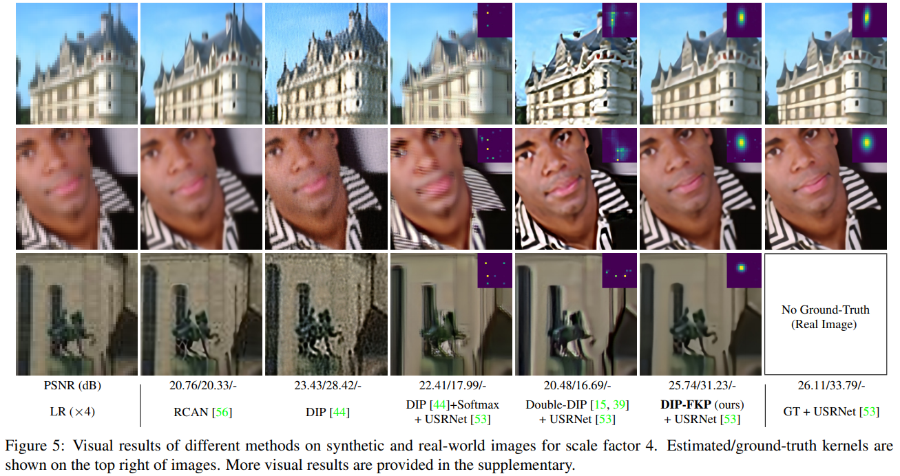
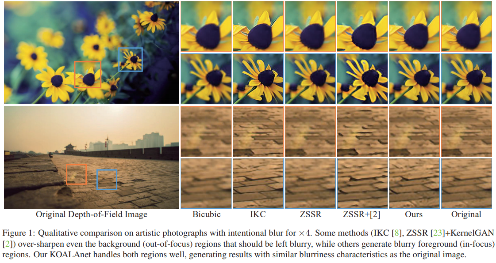
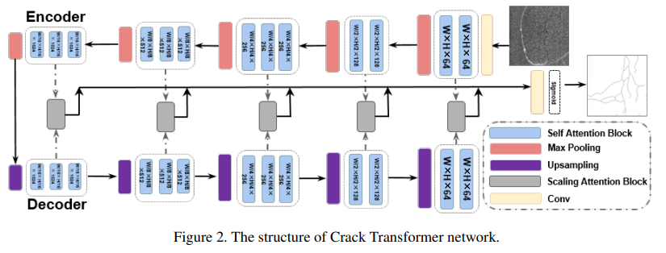
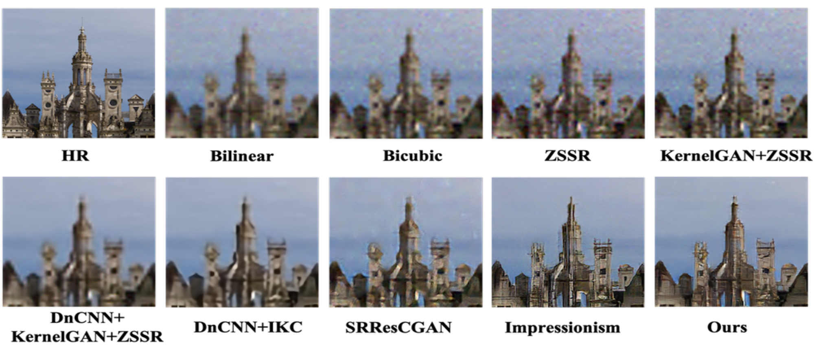
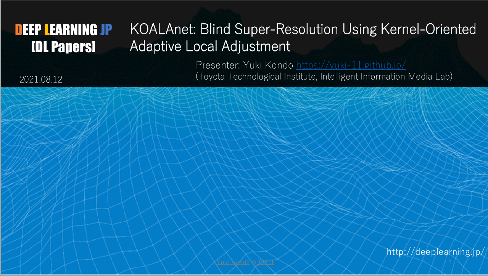
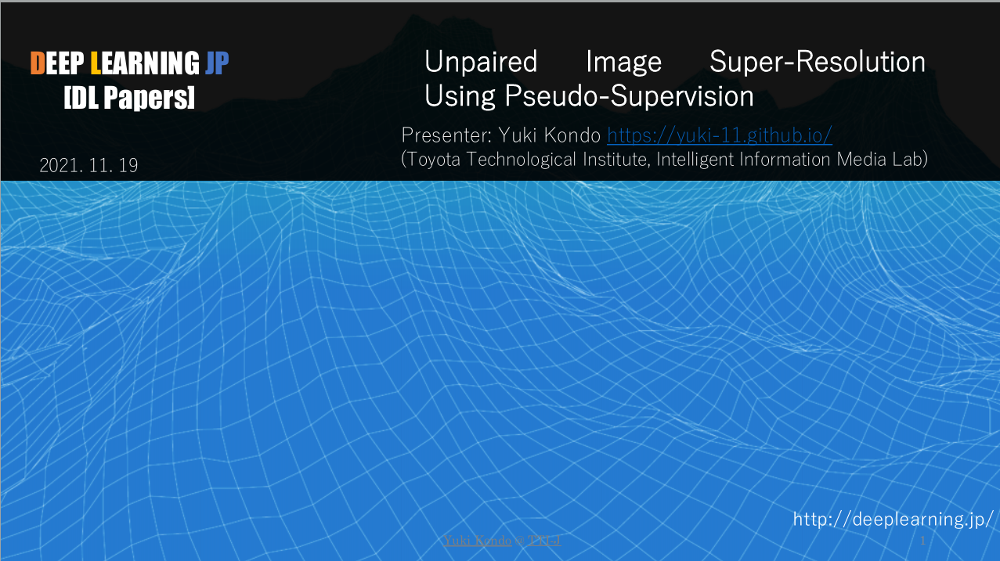

---
# Featured tags need to have either the `list` or `grid` layout (PRO only).
layout: page

# The title of the tag's page.
title: 活動歴

# The name of the tag, used in a post's front matter (e.g. tags: [<slug>]).
slug: activity

# (Optional) Write a short (~150 characters) description of this featured tag.
description: >
  This is a featured 

hide_description: true
# (Optional) You can disable grouping posts by date.
no_groups: true

# Exclude this example category from the sitemap.
# DON'T USE THIS SETTING IN YOUR CATEGORIES!
sitemap: false

permalink: /activity/
---

{:.note}

## メンバーシップ
----------------------------------------------------------------

### 2017年7月 -
* 会員: <b>トヨタ技術会(TES)</b>

### Sep. 2019 - Nov. 2021
* 部長 (創設者):　[豊田工業大学]{:.heading.flip-title} [SPARTAN RACE cirle Ares]{:.heading.flip-title}

### 2020年12月 -
* 会員: [Community of Deep Learning Evangelists(CDLE)]{:.heading.flip-title} 

### 2021年2月 -
* サーベイメンバー: [cvpaper.challenge]{:.heading.flip-title} 
  * **CVPR2021論文サマリ**
    * "[Flow-Based Kernel Prior With Application to Blind Super-Resolution]{:.heading.flip-title}"
        
      

        
      

     
    * "[KOALAnet: Blind Super-Resolution Using Kernel-Oriented Adaptive Local Adjustment]{:.heading.flip-title}"
        
      

        
      

  * **ICCV2021論文サマリ**
    * "[CrackFormer: Transformer Network for Fine-Grained Crack Detection]{:.heading.flip-title}"
        
      

        
      

     
    * "[Unsupervised Real-World Super-Resolution: A Domain Adaptation Perspective]{:.heading.flip-title}"
        
      

        
      

### 2021年2月 -
* 会員: [Deep Learning.JP]{:.heading.flip-title} 
  * **Deep Learning 輪読会**
    * "[KOALAnet: Blind Super-Resolution Using Kernel-Oriented Adaptive Local Adjustment](https://www.slideshare.net/DeepLearningJP2016/dlkoalanet-blind-superresolution-using-kerneloriented-adaptive-local-adjustment-250013597?qid=62133bb3-3833-444d-8d22-62a8f8f4630c&v=&b=&from_search=1){:.heading.flip-title}"
        
      

        
      

     
    * "[Unpaired Image Super-Resolution Using Pseudo-Supervision]{:.heading.flip-title}"
        
      

        
      

[Community of Deep Learning Evangelists(CDLE)]: https://www.cdle.jp/
[SPARTAN RACE cirle Ares]: https://yuki-11.github.io/Ares/
[豊田工業大学]: https://www.toyota-ti.ac.jp/english/
[Deep Learning.JP]: https://deeplearning.jp/
[cvpaper.challenge]: http://xpaperchallenge.org/cv/
[Flow-Based Kernel Prior With Application to Blind Super-Resolution]: http://xpaperchallenge.org/cv/survey/cvpr2021_summaries/446/
[KOALAnet: Blind Super-Resolution Using Kernel-Oriented Adaptive Local Adjustment]: http://xpaperchallenge.org/cv/survey/cvpr2021_summaries/471/
[CrackFormer: Transformer Network for Fine-Grained Crack Detection]: http://xpaperchallenge.org/cv/survey/iccv2021_summaries/150/
[Unsupervised Real-World Super-Resolution: A Domain Adaptation Perspective]: http://xpaperchallenge.org/cv/survey/iccv2021_summaries/170/

[Unpaired Image Super-Resolution Using Pseudo-Supervision]: https://www.slideshare.net/DeepLearningJP2016/dlunpaired-image-superresolution-using-pseudosupervision-250714142

<!-- * [Install]{:.heading.flip-title} --- How to install and run Hydejack.
{:.related-posts.faded}

[install]: http://www.toyota.co.jp/company/gakuen/index.html -->
