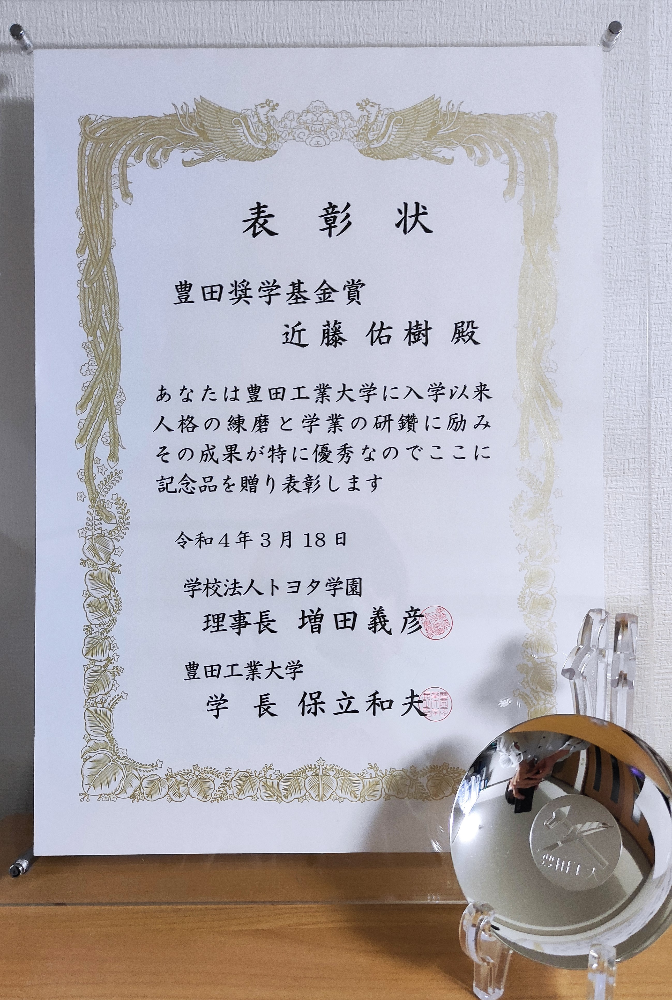
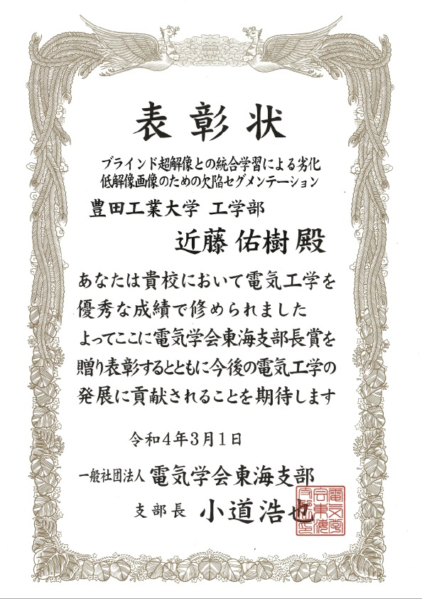

---
# Featured tags need to have either the `list` or `grid` layout (PRO only).
layout: page

# The title of the tag's page.
title: 受賞

# The name of the tag, used in a post's front matter (e.g. tags: [<slug>]).
slug: awards

# (Optional) Write a short (~150 characters) description of this featured tag.
description: >
  受賞

hide_description: true
# (Optional) You can disable grouping posts by date.
no_groups: true

# Exclude this example category from the sitemap.
# DON'T USE THIS SETTING IN YOUR CATEGORIES!
sitemap: false

permalink: /awards/
---

{:.note}

## 2022年
----------------------------------------------------------------

* <b>豊田奨学基金賞</b>

  

 

* <b>電気学会 東海支部長賞</b>
<!-- * [電気学会 東海支部長賞]{:.heading.flip-title} -->

  

 

* <b>派遣企業の会 社会人学生優秀賞</b>

  

## 2021年
----------------------------------------------------------------
* [東京大学 グローバル消費インテリジェンス寄附講座(GCI) Winter 2020 優秀修了生]{:.heading.flip-title}

  

 

* [Best practical paper award in the 17th International Conference on Machine Vision Applications (MVA2021)]{:.heading.flip-title} . ["Crack Segmentation for Low-Resolution Images using Joint Learning with Super-Resolution"]{:.heading.flip-title}

  

[電気学会 東海支部長賞]: https://www.iee.jp/tokai/award/%E6%94%AF%E9%83%A8%E9%95%B7%E8%B3%9E%E5%8F%97%E8%B3%9E%E8%80%852020%E5%B9%B4/

[東京大学 グローバル消費インテリジェンス寄附講座(GCI) Winter 2020 優秀修了生]: https://gci.t.u-tokyo.ac.jp/gci2020winter-honors/

[Best practical paper award in the 17th International Conference on Machine Vision Applications (MVA2021)]: http://www.mva-org.jp/archives.BestPracticalPaperAward.php

["Crack Segmentation for Low-Resolution Images using Joint Learning with Super-Resolution"]: https://yuki-11.github.io/ja/papers/

<!-- * [Install]{:.heading.flip-title} --- How to install and run Hydejack.
{:.related-posts.faded}

[install]: http://www.toyota.co.jp/company/gakuen/index.html -->
