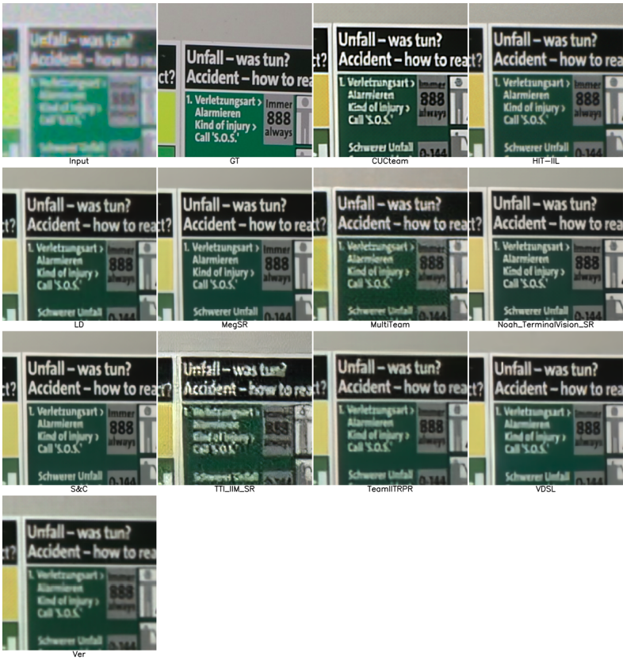
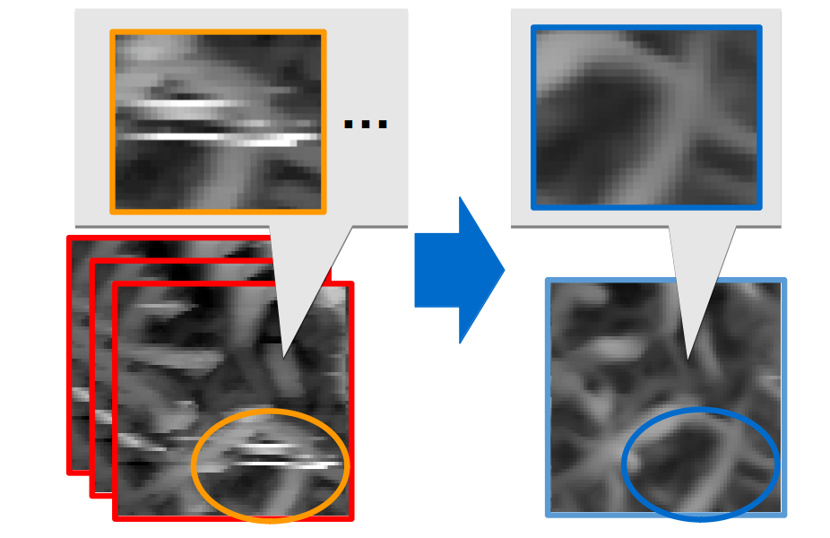

---
# Featured tags need to have either the `list` or `grid` layout (PRO only).
layout: page

# The title of the tag's page.
title: 論文

# The name of the tag, used in a post's front matter (e.g. tags: [<slug>]).
slug: papers

# (Optional) Write a short (~150 characters) description of this featured tag.
description: >
  This is a featured 

hide_description: true
# (Optional) You can disable grouping posts by date.
no_groups: true

# Exclude this example category from the sitemap.
# DON'T USE THIS SETTING IN YOUR CATEGORIES!
sitemap: false

permalink: /papers/
---

{:.note}

## 国際会議
----------------------------------------------------------------
* Goutam Bhat et al., 
&nbsp;NTIRE 2022 Burst Super-Resolution Challenge, 
&nbsp;Proc. of New Trends in Image Restoration and Enhancement Workshop ([NTIRE2022]{:.heading.flip-title}), [CVPRW2022]{:.heading.flip-title},
&nbsp;June, 2022.
&nbsp;[<a href='https://openaccess.thecvf.com/content/CVPR2022W/NTIRE/html/Bhat_NTIRE_2022_Burst_Super-Resolution_Challenge_CVPRW_2022_paper.html'>pdf</a>]

  

* Yuki Kondo, Norimichi Ukita, 
&nbsp;Crack Segmentation for Low-Resolution Images using Joint Learning with Super-Resolution, 
&nbsp;Proc. of the 17th International Conference on Machine Vision Applications ([MVA2021]{:.heading.flip-title}), 
&nbsp;July, 2021. (oral acceptance rate = 19%). [Best practical paper award]{:.heading.flip-title}
&nbsp;[<a href='http://www.mva-org.jp/Proceedings/2021/papers/O1-1-2.pdf'>pdf</a>], [<a href='https://github.com/Yuki-11/CSSR'>code</a>]

  

## 国内会議
----------------------------------------------------------------
* 安江楓真、近藤佑樹、新庄康太、秋田和俊、三星響、吉村雅満、浮田宗伯 
&nbsp;連続撮影されたSPM画像による相互補完的なノイズ除去, 
&nbsp;研究報告コンピュータビジョンとイメージメディア ([CVIM230]{:.heading.flip-title}),
&nbsp;2021年5月
&nbsp;[<a href='https://ipsj.ixsq.nii.ac.jp/ej/?action=pages_view_main&active_action=repository_view_main_item_detail&item_id=217840&item_no=1&page_id=13&block_id=8'>pdf</a>]

  

<!-- ## Apr. 2012 - Feb. 2015
----------------------------------------------------------------
* [Youth, Toyota Motor Corporation]{:.heading.flip-title} 

## Mar. 2015 -
----------------------------------------------------------------
* **Technician**, [Toyota Motor Corporation]{:.heading.flip-title} 

## Nov. 2019 -
----------------------------------------------------------------
* **Part time jobs**, [Intelligent Information Media Lab]{:.heading.flip-title} **at** [Toyota Technological Institute]{:.heading.flip-title}

## Apr. 2021 -
----------------------------------------------------------------
* **Teaching Assistant**, [Chair for Global Consumer Intelligence (GCI)]{:.heading.flip-title} **at** [University of Tokyo]{:.heading.flip-title}  -->

[Crack Segmentation for Low-Resolution Images using Joint Learning with Super-Resolution]: #
[MVA2021]: http://www.mva-org.jp/mva2021/
[NTIRE2022]: https://data.vision.ee.ethz.ch/cvl/ntire22/
[CVPRW2022]: https://cvpr2022.thecvf.com/workshop-schedule
[CVIM230]: http://cvim.ipsj.or.jp/index.php?id=cvim230p
[Toyota Motor Corporation]: https://global.toyota/
[Intelligent Information Media Lab]: https://www.toyota-ti.ac.jp/Lab/Denshi/iim/index.html
[Toyota Technological Institute]: https://www.toyota-ti.ac.jp/english/
[Chair for Global Consumer Intelligence (GCI)]: https://gci.t.u-tokyo.ac.jp/gci-2021-summer/
[University of Tokyo]: https://www.u-tokyo.ac.jp/ja/index.html
[Best practical paper award]: http://www.mva-org.jp/archives.BestPracticalPaperAward.php
<!-- * [Install]{:.heading.flip-title} --- How to install and run Hydejack.
{:.related-posts.faded}

[install]: http://www.toyota.co.jp/company/gakuen/index.html -->
